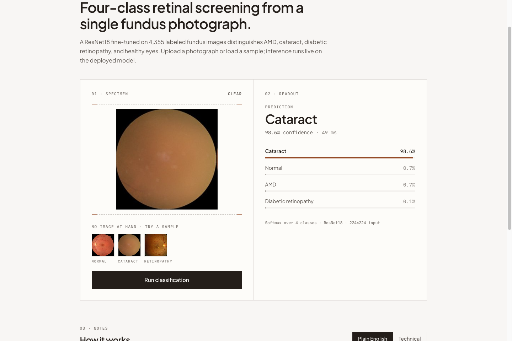

# Retina Fundus Classification

End-to-end retina fundus image classifier: a ResNet18 (PyTorch) fine-tuned to detect **AMD, cataract, diabetic retinopathy, and normal** eyes, served by a **FastAPI** backend and a **React** upload UI. Backend deploys to **Hugging Face Spaces** (Docker), frontend to **Vercel**.

**[Live Demo](https://fundus-dx-ml.vercel.app/)**



> ⚠️ Educational project — not a medical device and not for clinical use.

## Architecture

- **Frontend**: React + Tailwind CSS + Vite, hosted on [Vercel](https://fundus-dx-ml.vercel.app/)
- **Backend**: FastAPI serving the PyTorch model, hosted on [Hugging Face Spaces](https://huggingface.co/spaces/Depryx/fundus-ml) via Docker
- **Model**: ResNet18 (ImageNet-initialized) with the final FC layer replaced for 4 classes

```
├── api/main.py           # FastAPI server, /predict endpoint, loads best_model.pth
├── shared.py             # CLASS_NAMES, device selection, transform, model builder
├── train.py              # Training with early stopping on target val accuracy
├── evaluate_model.py     # Validation metrics + confusion matrix → reports/
├── test_external.py      # Domain-shift testing (CLAHE, TTA options)
├── organize_data.py      # Seeded 80/20 train/val split
├── scripts/make_synthetic_samples.py  # Synthetic demo images (no patient data)
├── samples/synthetic/    # Committed synthetic fundus-like images
├── tests/                # pytest suite (API, model config, data split)
├── best_model.pth        # Trained weights (4-class AMD model)
├── frontend/             # React upload UI
└── Dockerfile            # Hugging Face Spaces deployment (port 7860)
```

### Classes

`['amd', 'cataract', 'diabetic_retinopathy', 'normal']` — defined once in [shared.py](shared.py) and imported everywhere. The order is alphabetical because torchvision's `ImageFolder` assigns label indices alphabetically; a regression test (`tests/test_shared.py`) guards this.

**Why no glaucoma?** Glaucoma diagnosis requires clinical factors beyond fundus photography (OCT-based RNFL thinning, intraocular pressure, visual fields, stereoscopic disc assessment). It was replaced with AMD, which presents clear visual markers (drusen, pigment changes) suited to fundus image classification.

## Setup

```bash
python -m venv .venv && source .venv/bin/activate
pip install -r requirements-dev.txt   # runtime deps + pytest, httpx, opencv
```

Python 3.10+ recommended. Device auto-detection: CUDA > Apple Silicon (MPS) > CPU.

## Data

- Place raw images under `data/raw/dataset/{amd,cataract,diabetic_retinopathy,normal}/` (one folder per class). Public fundus datasets such as ODIR-5K / Kaggle cataract & DR datasets work; no data is committed to this repo.
- Split into train/val:

```bash
python organize_data.py   # seeded 80/20 split → data/processed/{train,val}/
```

## Train

```bash
python train.py --data-dir data/processed --num-epochs 25 --batch-size 32 --target-acc 0.90
```

Fine-tunes ResNet18 (ImageNet weights) with horizontal-flip + rotation augmentation, SGD + StepLR. Saves the best weights to `best_model.pth` each time validation accuracy improves, and **stops early** once `--target-acc` is reached. The committed model reached **97.7% val accuracy**.

## Evaluate

```bash
python evaluate_model.py
```

Prints precision/recall/F1 per class plus a confusion matrix, and writes a timestamped report to `reports/`.

### Results (validation set, 871 images, 2026-06-11)

| Class | Precision | Recall | F1 | Support |
|---|---|---|---|---|
| amd | 0.98 | 0.98 | 0.98 | 100 |
| cataract | 0.98 | 0.95 | 0.96 | 208 |
| diabetic_retinopathy | 1.00 | 0.99 | 1.00 | 348 |
| normal | 0.94 | 0.98 | 0.96 | 215 |
| **accuracy** | | | **0.98** | 871 |

Confusion matrix (rows = true, cols = predicted):

| | amd | cataract | diabetic_retinopathy | normal |
|---|---|---|---|---|
| **amd** | 98 | 0 | 0 | 2 |
| **cataract** | 1 | 198 | 0 | 9 |
| **diabetic_retinopathy** | 1 | 0 | 345 | 2 |
| **normal** | 0 | 5 | 0 | 210 |

## Run Locally

**Backend API** (keep `best_model.pth` in the project root):
```bash
uvicorn api.main:app --reload --host 0.0.0.0 --port 8000
```

**Frontend**:
```bash
cd frontend
npm install
cp .env.example .env   # optional; defaults to http://localhost:8000
npm run dev
```

**Both at once**: `./start_dev.sh`

**Try it without patient data** — generate synthetic fundus-like images and upload one in the UI, or hit the API directly:
```bash
python scripts/make_synthetic_samples.py
curl -F "file=@samples/synthetic/synthetic_fundus_1.png" http://localhost:8000/predict
```

Response shape:
```json
{"prediction": "cataract", "confidence": 0.53, "probabilities": {"amd": 0.05, "cataract": 0.53, "diabetic_retinopathy": 0.06, "normal": 0.36}}
```
(Synthetic images exercise the pipeline; only real fundus photos produce meaningful predictions.)

## Tests

```bash
python -m pytest tests/ -q
```

Covers: `/predict` happy path on a synthetic image (valid class, probabilities sum to 1), rejection of non-image and corrupt uploads, saved-weights/class-count consistency, transform output shape, and the seeded 80/20 split (determinism + no train/val leakage).

## Domain Robustness Testing

Images from other cameras/sources suffer **domain shift** (lighting, resolution, preprocessing). `test_external.py` measures this on the images in `test_external_images/`:

```bash
python test_external.py          # Baseline
python test_external.py --tta    # Test-Time Augmentation (recommended)
python test_external.py --clahe  # CLAHE contrast normalization
```

Findings on the committed external set (6 images, 2026-06-11):

| Mode | Accuracy | Avg confidence |
|---|---|---|
| Baseline | 5/6 (83%) | 75% |
| **TTA** | **6/6 (100%)** | **79%** |

TTA averages predictions over flipped/rotated/jittered variants and recovers the baseline miss. CLAHE helps only if the model is also trained on CLAHE-processed images — see `DOMAIN_ROBUSTNESS_PLAN.md`.

## Deployment

- **Backend → Hugging Face Spaces**: the [Dockerfile](Dockerfile) builds a Python 3.11 image, copies `api/`, `shared.py`, and `best_model.pth`, runs as a non-root user, and serves uvicorn on port **7860** (Spaces default). Push with `git push hf main`.
- **Frontend → Vercel**: builds from `frontend/` (`npm run build`); set `VITE_API_URL` to the Space URL in Vercel project settings (see [frontend/.env.example](frontend/.env.example)).
- No credentials are stored in this repo.

## Claim → Evidence Map

| Claim | Evidence |
|---|---|
| ResNet18 fundus classifier, 4 classes | [shared.py](shared.py) (`CLASS_NAMES`, `build_resnet18`), [train.py](train.py); verified by `tests/test_shared.py` |
| ImageNet-initialized weights | [train.py:44](train.py) (`ResNet18_Weights.IMAGENET1K_V1`) |
| Early stopping against a target accuracy threshold | [train.py](train.py) `--target-acc`; committed model stopped at 97.7% val acc with `--target-acc 0.90` |
| Trained & evaluated | Metrics + confusion matrix tables above; reproduce with `python evaluate_model.py` |
| FastAPI service serving the PyTorch model | [api/main.py](api/main.py) `/predict`; exercised by `tests/test_api.py` |
| React (+ Tailwind) frontend | [frontend/src/App.jsx](frontend/src/App.jsx); `npm run build` and `npm run lint` pass |
| Hugging Face Spaces deployment (Docker) | [Dockerfile](Dockerfile), [live Space](https://huggingface.co/spaces/Depryx/fundus-ml) |
| Vercel deployment | [Live demo](https://fundus-dx-ml.vercel.app/) |
